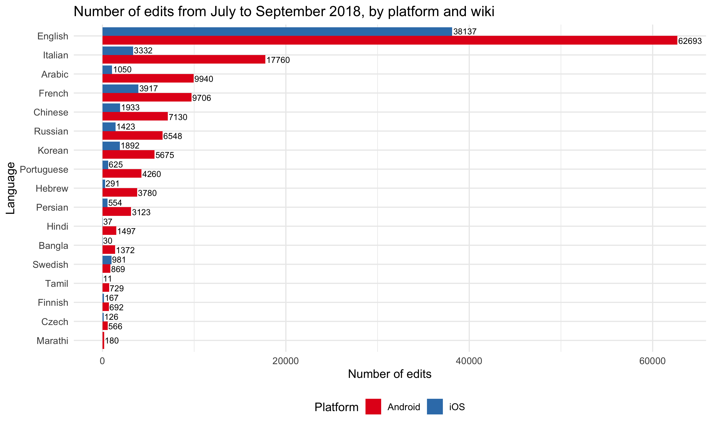
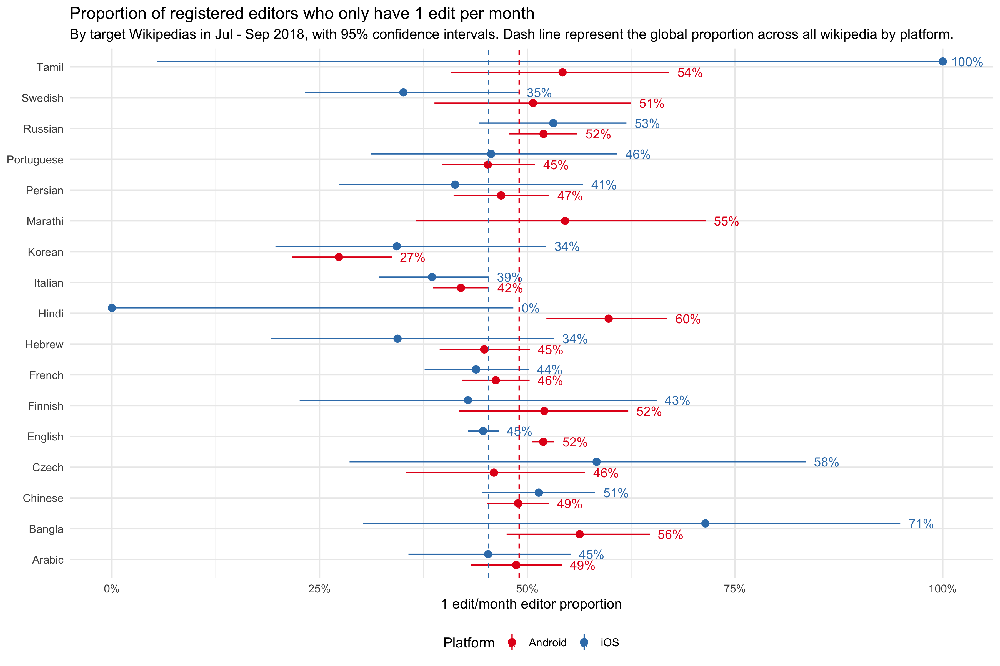
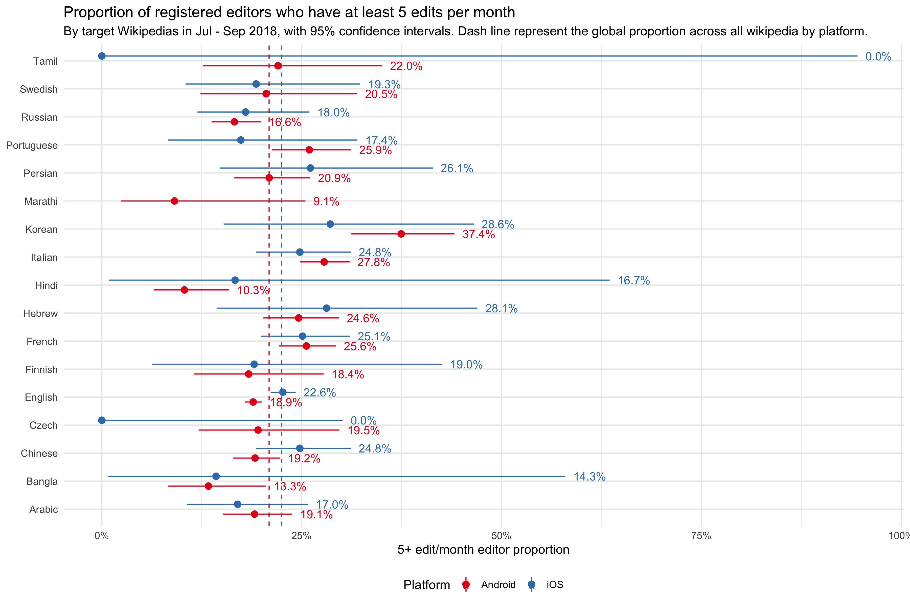
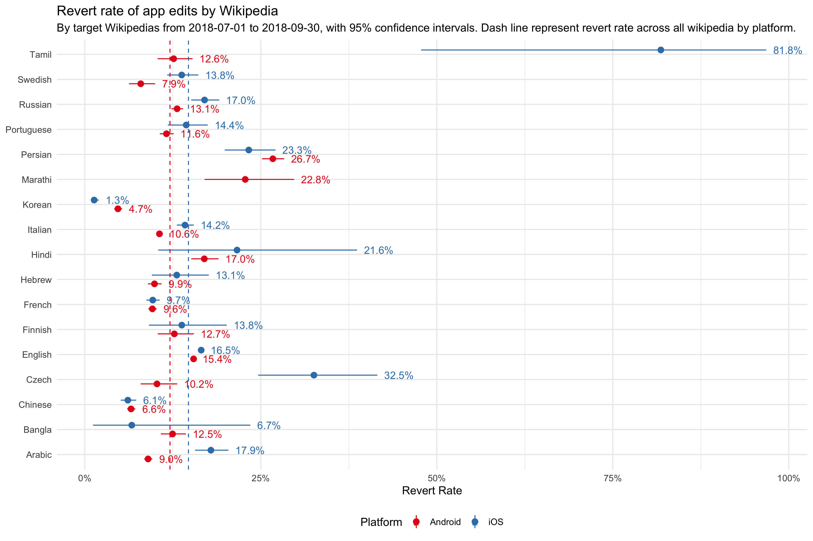
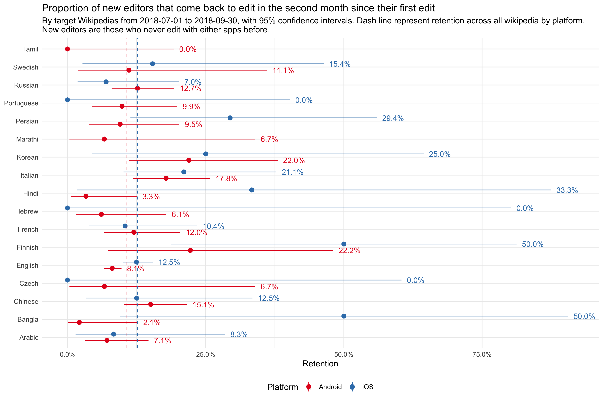
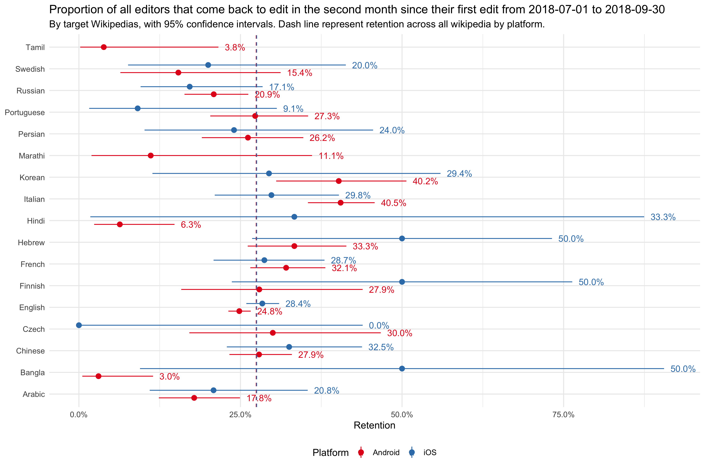

```{r setup, echo=FALSE, error=TRUE, message=FALSE, warning=FALSE}
set.seed(7)
if (file.exists("data/workspace.RData")) load("data/workspace.RData")

knitr::opts_chunk$set(
  error = TRUE, echo = FALSE, message = FALSE, warning = FALSE
)
library(tidyverse)
library(magrittr)
library(crosstalk)
library(glue)

target_wikis <- c("frwiki", "enwiki", "kowiki", "hiwiki", "cswiki")
target_wiki_languages <- c("English", "French", "Czech", "Korean", "Hindi")

source("data_processing.R")
```

```{r links, echo=FALSE, results='asis'}
cat('<p>{ <a href="https://github.com/wikimedia-research/App-iOS-Baseline_Program_Metrics_FY18-19/blob/master/report.Rmd">RMarkdown Source</a> | <a href="https://github.com/wikimedia-research/App-iOS-Baseline_Program_Metrics_FY18-19">Analysis Codebase</a> }</p>')
```

In FY18-19, the iOS team will develop contribution features of the app ([project page](https://www.mediawiki.org/wiki/Wikimedia_Apps/Team/iOS/Editing_program)).

This report is an initial exploration with two **goals**:

- Write relevant queries that can be productionized later (made to execute daily with data flowing into Druid/Superset).
- Learn what the program metrics look like right now so we can set our expectations accordingly.

## Executive Summary

*   **Total iOS app edit counts**: The daily iOS app edit count across all wikis is `r round(sum(active_wiki_edit_counts$edits)/length(unique(active_wiki_edit_counts$date)), 2)` on average. The daily average edits of English, French, Korean, Czech and Hindi Wikipedia are `r paste(active_wiki_edit_counts_summary$"Daily Average"[match(c("English", "French", "Korean", "Czech", "Hindi"), active_wiki_edit_counts_summary$Language)], collapse = ", ")` respectively. For most Wikipedias, content edits contribute to more than 90% of all iOS app edits. 

*   **iOS edits per editor**: Because of the right skewed distribution of edits per editor and the small number of iOS editors of most wikis, we suggest tracking the proportion of 1 edit editors among all registered editors who edit at least once via iOS app monthly, and tracking the proportion of 5+ edit editors among all registered editors who edit at least once via iOS app monthly. 

    Across all Wikipedias, the 1 edit/month editor proportion is `r scales::percent(edit_by_editor_benchmarks$"1 edit/month editor proportion"[edit_by_editor_benchmarks$metric=="Global*"])`. The 1 edit/month editor proportion of English and French Wikipedia are `r paste(scales::percent(target_editor_prop_1edit$mean[match(c("English", "French"), target_editor_prop_1edit$Language)]), collapse = " and ")` respectively. Because Korean, Czech and Hindi Wikipedia have very small number of iOS app editors, their proportions are **unreliable**. Across all Wikipedias, the 5+ edit/month editor proportion is `r scales::percent(edit_by_editor_benchmarks$"5+ edit/month editor proportion"[edit_by_editor_benchmarks$metric=="Global*"])`. The 5+ edit/month editor proportion of English and French Wikipedia are `r paste(scales::percent(target_editor_prop_5edit$mean[match(c("English", "French"), target_editor_prop_5edit$Language)]), collapse = " and ")` respectively. Because Korean, Czech and Hindi Wikipedia have very small number of iOS app editors, their proportions are **unreliable**.
    
*   **Revert rate of iOS edits**: The revert rate of iOS app edits across all Wikipedias is `r scales::percent(revert_rates_benchmarks$revert_rate[revert_rates_benchmarks$metric == "Global*"])`, which is higher than the revert rate across all platforms ([6% in August 2018](https://www.mediawiki.org/wiki/Wikimedia_Audiences#Contributors)). The iOS edits revert rates of English, French and Korean Wikipedia are `r paste(scales::percent(revert_rates$"Revert rate"[match(c("English", "French", "Korean"), revert_rates$Language)]), collapse = ", ")` respectively. Because Czech and Hindi Wikipedia have very small number of iOS app edits, their revert rates are **unreliable**.

*   **iOS new contributor retention rate**: For new iOS app editors of English and French Wikipedia, the second month retentions are `r paste(scales::percent(new_ios_editor_retention$retention_30[match(c("English", "French"), new_ios_editor_retention$language)]), collapse = " and ")` respectively. Since Korean, Czech and Hindi Wikipedia don’t have enough new editors, their retention rates are **unreliable**.

*   **iOS contributor retention rate**: For all iOS app editors of English and French Wikipedia, the second month retentions are `r paste(scales::percent(active_ios_editor_retention$retention_30[match(c("English", "French"), active_ios_editor_retention$language)]), collapse = " and ")` respectively. Since Korean, Czech and Hindi Wikipedia don’t have enough editors, their retention rates are **unreliable**.


## Metrics

In the [annual plan](https://www.mediawiki.org/wiki/Wikimedia_Apps/Team/iOS/Editing_program#Goals), we defined the following **primary metrics**:

*   **Total iOS app edit counts**: Number of non-bot edits which are tagged as made through the iOS app interface. We hope to increase the total number of edits made via the iOS app.

*   **iOS edits per editor**: For any given time period, of the non-bot registered users that completed at least 1 edit via the iOS app, how many edits did they complete on average (arithmetic mean/median). Edits on other platform won’t affect this metric. This metric will measure the efficiency of editing via the iOS app for existing editors, and we hope to increase it.

    Since the distribution of edits per editor is very right skewed with lots of 1 edit editors, the median edits/editor/month is 1 or 2 for most wikis with at least 10 editors, which means it would be very hard to see a change on this metric. And since we have so few iOS editors for most wikis, the average edits/editor/month is highly influenced by some very active editors who make a lot more edits than others.
    
    Instead, we suggest tracking the proportion of 1 edit editors among all registered editors who edit at least once via iOS app monthly. As we hope to make it much more efficient and enjoyable for these casual editors to do more via the app, the smaller this number is the better. Also, since we consider editors with at least 5 edits per month as [active editors](https://meta.wikimedia.org/wiki/Research:Active_editor) historically, we want to track the proportion of 5+ edit editors among all registered editors who edit at least once via iOS app monthly, although this threshold may be too high for mobile editing. We hope to increase this proportion on the iOS app.

We also defined these **health monitoring metrics**:

*   **Revert rate of iOS edits**: Proportion of iOS app edits which have been reverted. We will closely monitor revert rates for edits from the app to ensure that we are not increasing the burden on existing communities or reducing the quality of the projects. Although we expect some noise and fluctuation in this metric, it will need to remain roughly stable as we make changes.

*   **iOS contributor retention rate**: Number of editors who have made additional edits through the iOS app in the N days following their first iOS edit in the given time span (does not include anonymous editors and editors who have only made additional edits through other platforms following their first iOS edit). 

*   **iOS new contributor retention rate**: Number of new editors who have made additional edits through the iOS app in the N days following their first ever iOS edit (does not include anonymous editors and editors who have only made additional edits through other platforms following their first iOS edit). Platform-specific edit data was not available until June 29 via [T194424](https://phabricator.wikimedia.org/T194424). Prior to the deployment of the patch, all edits made in iOS and Android apps were lumped together under a single change tag "mobile app edit". Since multi-platform usage and platform switching are not common occurrences, any editor who has made a "mobile app edit"-tagged contribution previously is ineligible to be considered a new iOS editor.

    We believe that by making editing more efficient, enjoyable and understandable we will naturally see editors returning to the app and editing on a repeated basis. We are not building features specifically to boost this number, but if we are seeing more edits, but unable to keep those editors engaged that will be a negative signal that we will have to address.

In this report, we will compute the baseline for all languages of Wikipedia, with a focus on our **target Wikipedia** in the [annual plan](https://www.mediawiki.org/wiki/Wikimedia_Apps/Team/iOS/Editing_program#Partner_Wikis): English, French, Korean, Hindi and Czech.

**Query**:
```SQL
SELECT
ios_app_edit_counts.local_user_id AS local_user_id,
IFNULL(previous_app_editors.new_ios_editor, 'TRUE') AS new_ios_editor,
edit_date,
edits,
content_edits
FROM (
SELECT
local_user_id,
edit_date,
COUNT(*) AS edits,
SUM(namespace = 0) AS content_edits
FROM (
-- Edits made with iOS app on visible pages:
SELECT
rev_user AS local_user_id,
DATE(LEFT(rev_timestamp, 8)) AS edit_date,
page.page_namespace AS namespace
FROM change_tag
INNER JOIN revision ON (
revision.rev_id = change_tag.ct_rev_id
AND revision.rev_timestamp >= '{start_date}'
AND revision.rev_timestamp < '{end_date}'
AND change_tag.ct_tag = 'ios app edit'
)
LEFT JOIN page ON revision.rev_page = page.page_id
UNION ALL
-- Edits made with iOS app on deleted pages:
SELECT
ar_user AS local_user_id,
DATE(LEFT(ar_timestamp, 8)) AS edit_date,
ar_namespace AS namespace
FROM change_tag
INNER JOIN archive ON (
archive.ar_rev_id = change_tag.ct_rev_id
AND archive.ar_timestamp >= '{start_date}'
AND archive.ar_timestamp < '{end_date}'
AND change_tag.ct_tag = 'ios app edit'
)
) AS ios_app_edits
GROUP BY local_user_id, edit_date
) AS ios_app_edit_counts
LEFT JOIN (
-- Editors who have used a mobile app (Android/iOS)
-- to edit Wikipedia before the start_date:
SELECT DISTINCT local_user_id,
'FALSE' as new_ios_editor
FROM (
-- Editors who have previously used a mobile app to edit visible pages:
SELECT rev_user AS local_user_id
FROM change_tag
INNER JOIN revision ON (
revision.rev_id = change_tag.ct_rev_id
AND revision.rev_timestamp < '{start_date}'
AND change_tag.ct_tag = 'mobile app edit'
)
UNION ALL
-- Editors who have previously used a mobile app to edit deleted pages:
SELECT ar_user AS local_user_id
FROM change_tag
INNER JOIN archive ON (
archive.ar_rev_id = change_tag.ct_rev_id
AND archive.ar_timestamp < '{start_date}'
AND change_tag.ct_tag = 'mobile app edit'
)
) AS combined_revisions
) AS previous_app_editors
ON previous_app_editors.local_user_id = ios_app_edit_counts.local_user_id
```


## Total iOS app edit counts

Total iOS app edit counts is the number of non-bot edits which are tagged as made through the iOS app interface. Since it's very unlikely that a bot would use the app to edit, bot filter was not included in the query. We hope to increase the total number of edits made via the iOS app.

### All Edits {#total_edits}

This following graph shows the daily number of iOS app edits by all active Wikipedias, from `r start_date` to `r end_date`.

```{r active_all_edits_plot}
sd_all <- SharedData$new(active_wiki_edit_counts)
widgets_all <- bscols(widths = 12, filter_select("active_wiki_edit_counts_widget", "Select languages", sd_all, ~language, allLevels = TRUE))
widgets_all
plotly::plot_ly(sd_all, x = ~date, y = ~edits, type = 'scatter', mode = 'lines', color = ~language) %>%
  plotly::layout(title = 'Number of edits made with iOS app, by Wikipedia',
       xaxis = list(title = 'Date'),
       yaxis = list (title = 'Wikipedia edits')) %>% 
  plotly::hide_legend()
```
<br>

The table below shows the mean, median and total iOS app edits by all active Wikipedias, from `r start_date` to `r end_date`.
```{r active_all_edits_summary}
active_wiki_edit_counts_summary <- active_wiki_edit_counts %>%
  dplyr::group_by(`Language`=language) %>%
  dplyr::summarize(`Daily Average` = round(mean(edits), 2), `Daily Median` = median(edits), Total = sum(edits))

sketch_active_wiki_edit_counts_summary <- htmltools::withTags(table(
  DT::tableHeader(c("", names(active_wiki_edit_counts_summary))),
  DT::tableFooter(c(rep("",4), names(active_wiki_edit_counts_summary)[4]))
))
DT::datatable(
  active_wiki_edit_counts_summary,
  container = sketch_active_wiki_edit_counts_summary,
  filter = "top",
  extensions = "Buttons",
  options = list(
    pageLength = 10, autoWidth = TRUE, language = list(search = "Filter:"),
    order = list(list(1, "asc")), dom = "Bfrtip", buttons = c("copy", "csv"),
    footerCallback = DT::JS(
      "function( tfoot, data, start, end, display ) {",
      "var api = this.api(), data;",
      "$( api.column(4).footer()).html('Total: '+",
      "api.column(4).data().reduce( function ( a, b ) {",
      "return a + b;",
      "} )",
      ");",
      "}")
  )
)
```

### Content Edits

Content edit counts is the number of iOS app edits made on the main namespace (namespace 0) of each Wikipedia. This following graph shows the daily number of iOS app content edits by all active Wikipedias, from `r start_date` to `r end_date`.

```{r active_content_edits_plot}
sd_content <- SharedData$new(active_wiki_edit_counts)
widgets_content <- bscols(widths = 12, filter_select("active_content_edit_counts_widget", "Select languages", sd_content, ~language, allLevels = TRUE))
widgets_content
plotly::plot_ly(sd_content, x = ~date, y = ~content_edits, type = 'scatter', mode = 'lines', color = ~language) %>%
  plotly::layout(title = 'Number of content edits made with iOS app, by Wikipedia',
         xaxis = list(title = 'Date'),
         yaxis = list (title = 'Wikipedia content edits')) %>% 
  plotly::hide_legend()
```
<br>

The table below shows the mean, median, total iOS app content edits and their percentage of all edits, by all active Wikipedias from `r start_date` to `r end_date`.

```{r active_content_edits_summary}
active_content_edit_counts_summary <- active_wiki_edit_counts %>%
  dplyr::group_by(`Language`=language) %>%
  dplyr::summarize(`Daily Average` = round(mean(content_edits),2), 
                   `Daily Median` = median(content_edits), 
                   `Percentage of All Edits` = sum(content_edits)/sum(edits),
                   Total = sum(content_edits))

sketch_active_content_edit_counts_summary <- htmltools::withTags(table(
  DT::tableHeader(c("", names(active_content_edit_counts_summary))),
  DT::tableFooter(c(rep("",5), names(active_content_edit_counts_summary)[5]))
))
DT::datatable(
  active_content_edit_counts_summary,
  container = sketch_active_content_edit_counts_summary,
  filter = "top",
  extensions = "Buttons",
  options = list(
    pageLength = 10, autoWidth = TRUE, language = list(search = "Filter:"),
    order = list(list(1, "asc")), dom = "Bfrtip", buttons = c("copy", "csv"),
    footerCallback = DT::JS(
      "function( tfoot, data, start, end, display ) {",
      "var api = this.api(), data;",
      "$( api.column(5).footer()).html('Total: '+",
      "api.column(5).data().reduce( function ( a, b ) {",
      "return a + b;",
      "} )",
      ");",
      "}")
  )
) %>%
DT::formatPercentage('Percentage of All Edits', 2)
```

### Summary

- The daily iOS app edit count across all wikis is `r round(sum(active_wiki_edit_counts$edits)/length(unique(active_wiki_edit_counts$date)), 2)` on average. The daily average edits of English, French, Korean, Czech and Hindi Wikipedia are `r paste(active_wiki_edit_counts_summary$"Daily Average"[match(c("English", "French", "Korean", "Czech", "Hindi"), active_wiki_edit_counts_summary$Language)], collapse = ", ")` respectively.
- The daily iOS app content edit count across all wikis is `r round(sum(active_wiki_edit_counts$content_edits)/length(unique(active_wiki_edit_counts$date)), 2)` on average. The daily average content edits of English, French, Korean, Czech and Hindi Wikipedia are `r paste(active_content_edit_counts_summary$"Daily Average"[match(c("English", "French", "Korean", "Czech", "Hindi"), active_content_edit_counts_summary$Language)], collapse = ", ")` respectively.
- For most Wikipedias, content edits contribute to more than 90% of all iOS app edits. Among wikis with more than 1 edit daily on average, only Indonesian and Latvian Wikipedia's content edits are less than 90% -- only `r scales::percent(active_content_edit_counts_summary$"Percentage of All Edits"[active_content_edit_counts_summary$Language == "Indonesian"])` edits on Indonesian and `r scales::percent(active_content_edit_counts_summary$"Percentage of All Edits"[active_content_edit_counts_summary$Language == "Latvian"])` edits on Latvian are content edits.


## iOS edits by editor

For any given time period, of the non-bot registered users that completed at least 1 edit via the iOS app, we're interested in knowing how many edits did they complete on average (arithmetic mean/median). This metric will measure the efficiency of editing via the iOS app for existing editors, and we hope to increase it. Edits on other platform won’t affect this metric. Since it's very unlikely that a bot would use the app to edit, bot filter was not included in the query.

Here we started by counting the number of edits per editor in July, August and September 2018 without doing any aggregation, since we want to see the distribution before determine whether we should use mean or median, or other aggregation metrics. The following graph shows the distribution of edits per editor per month in July, August and September 2018 by target Wikipedias. We can see that most editors only complete one edit per month.

```{r target_edit_by_editor_data}
target_wiki_edit_by_editor_pdata <- edits_per_editor_monthly %>%
  dplyr::filter(wiki %in% target_wikis, local_user_id != 0) %>%
  dplyr::mutate(
    edits = factor(dplyr::case_when(
      edits < 6 ~ paste(edits, "edits"),
      edits >= 6 & edits < 11 ~ "6 - 10 edits",
      edits >= 11 & edits < 16 ~ "11 - 15 edits",
      edits >= 16 & edits < 21 ~ "16 - 20 edits",
      edits >= 21 & edits < 31 ~ "21 - 30 edits",
      edits >= 31 & edits < 51 ~ "31 - 50 edits",
      edits >= 51 & edits < 101 ~ "51 - 100 edits",
      edits >= 101 ~ "101+ edits"
    ),
    levels = c(paste(1:5, "edits"), "6 - 10 edits", "11 - 15 edits", "16 - 20 edits", "21 - 30 edits",
               "31 - 50 edits", "51 - 100 edits", "101+ edits"))
  ) %>%
  dplyr::group_by(month, language, edits) %>%
  dplyr::summarize(n_editor = n())

active_edit_by_editor_summary <- edits_per_editor_monthly %>%
  dplyr::group_by(`Language`=language) %>%
  dplyr::summarize(
    `Number of registered editors (monthly average)` = round(length(local_user_id[local_user_id != 0 & edits != 0])/length(unique(month)), 2),
    `Average edits/editor/month` = round(mean(edits[local_user_id != 0]), 2), 
    `Median edits/editor/month` = median(edits[local_user_id != 0]),
    `1 edit/month editor proportion` = length(local_user_id[local_user_id != 0 & edits == 1]) / length(local_user_id[local_user_id != 0 & edits != 0]),
    `5+ edit/month editor proportion` = length(local_user_id[local_user_id != 0 & edits >= 5]) / length(local_user_id[local_user_id != 0 & edits != 0]),
    `Anonymous edits (monthly average)` = round(sum(edits[local_user_id == 0]) / length(unique(month)), 2),
    `Anonymous edits proportion` = sum(edits[local_user_id == 0]) / sum(edits)
    ) %>% 
  replace(., is.na(.), 0)

target_wiki_edit_by_editor_summary <- active_edit_by_editor_summary %>%
  filter(Language %in% target_wiki_languages)

edit_by_editor_benchmarks <- tibble(
  metric = c("Global*", "Average*"),
  "1 edit/month editor proportion" = c(
    length(edits_per_editor_monthly$local_user_id[edits_per_editor_monthly$local_user_id != 0 & edits_per_editor_monthly$edits == 1]) / length(edits_per_editor_monthly$local_user_id[edits_per_editor_monthly$local_user_id != 0 & edits_per_editor_monthly$edits != 0]),
    mean(active_edit_by_editor_summary$`1 edit/month editor proportion`[active_edit_by_editor_summary$`Number of registered editors (monthly average)`>10])
  ),
  "5+ edit/month editor proportion" =  c(
    length(edits_per_editor_monthly$local_user_id[edits_per_editor_monthly$local_user_id != 0 & edits_per_editor_monthly$edits >= 5]) / length(edits_per_editor_monthly$local_user_id[edits_per_editor_monthly$local_user_id != 0 & edits_per_editor_monthly$edits != 0]),
    mean(active_edit_by_editor_summary$`5+ edit/month editor proportion`[active_edit_by_editor_summary$`Number of registered editors (monthly average)`>10])
  )
)
```

```{r target_edit_by_editor_plot, fig.height=10}
annotate_text <- data.frame(
  label = paste("Average editors/month: ", target_wiki_edit_by_editor_summary$`Number of registered editors (monthly average)`),
  language = target_wiki_edit_by_editor_summary$Language,
  month = rep("Jul", length(target_wikis))
)
ggplot2::ggplot(data = target_wiki_edit_by_editor_pdata, aes(x = edits, y = n_editor, fill = month)) +
  ggplot2::geom_bar(stat = "identity", position = "dodge") +
  ggplot2::scale_fill_brewer("Month", palette = "Set1") +
  ggplot2::labs(y = 'Number of editors', x = 'Number of edits', 
                title = 'Distribution of edits per editor per month in July, August and September 2018, by target Wikipedia') +
  ggplot2::facet_wrap(~language, ncol=1, scales = "free_y") + 
  wmf::theme_facet(axis.text.x = element_text(angle = -20)) +
  geom_text(
    data = annotate_text,
    mapping = aes(x = Inf, y = Inf, label = label),
    hjust   = 1.1,
    vjust   = 1.2
  )
```

Since the distribution of edits per editor is very right skewed with lots of 1 edit editors, from the table below, we can see the median edits/editor/month is 1 or 2 for most wikis with at least 10 editors, which means it would be very hard to see a change on this metric. And since we have so few iOS editors for most wikis, the average edits/editor/month is highly influenced by some very active editors who make a lot more edits than others.

Instead, we suggest tracking the proportion of 1 edit editors among all registered editors who edit at least once via iOS app monthly. As we hope to make it much more efficient and enjoyable for these casual editors to do more via the app, the smaller this number is the better. Also, since we consider editors with at least 5 edits per month as [active editors](https://meta.wikimedia.org/wiki/Research:Active_editor) historically, we want to track the proportion of 5+ edit editors among all registered editors who edit at least once via iOS app monthly, although this threshold may be too high for mobile editing. We hope to increase this proportion on the iOS app. 

The graph and table below show the 1 edit/month editors proportion and 5+ edit/month editors proportion. Please note that for Wikipedias with small number of editors, these metrics are **unreliable**.

```{r target_editor_proportion_plot, fig.width=12}
target_editor_prop_1edit <- edits_per_editor_monthly %>%
  filter(local_user_id != 0 & wiki %in% target_wikis) %>%
  dplyr::group_by(`Language`=language) %>%
  summarize(n_editor = length(local_user_id[edits != 0]),
            editor_1edit = length(local_user_id[edits == 1])) %>%
  ungroup %>%
  cbind(as.data.frame(binom:::binom.confint(x=.$editor_1edit, n = .$n_editor, methods = "prop.test")[, c("mean", "lower", "upper")]))
p1 <- ggplot(target_editor_prop_1edit, aes(x=Language, y=mean)) +
  geom_pointrange(aes(ymin = lower, ymax = upper), color="skyblue", size=1.3) +
  scale_y_continuous("1 edit/month editor proportion", labels = scales::percent_format()) + 
  ggplot2::geom_text(aes(label = scales::percent(mean), vjust = -1), size = 4, color = "skyblue") +
  theme_light() +
  coord_flip() +
  geom_hline(aes(yintercept = `1 edit/month editor proportion`), edit_by_editor_benchmarks, linetype = "dashed", color = c("tomato", "seagreen")) +
  annotate("text", y = edit_by_editor_benchmarks$`1 edit/month editor proportion`+c(0.02,-0.02), x = "Czech", label = edit_by_editor_benchmarks$metric, angle=90, color = c("tomato", "seagreen")) +
  theme(
    legend.position="none",
    panel.grid.major.y = element_blank(),
    panel.border = element_blank(),
    axis.ticks.y = element_blank(),
    axis.title.y = element_blank()
  ) +
  labs(ylab="1 edit/month editor proportion", title = "Proportion of registered editors who only have 1 edit per month",
       subtitle = "By target Wikipedias in July, August and September 2018, with 95% confidence intervals.",
       caption="*Global: This red dash line represents the proportion of registered editors \nwho only have 1 edit/month on iOS app across all wikis (unequally weighted). \n *Average: This green dash line represents the average of the 1 edit editor proportion\n of wikis with more than 10 editors per month on iOS app (equally weighted).")

target_editor_prop_5edit <- edits_per_editor_monthly %>%
  filter(local_user_id != 0 & wiki %in% target_wikis) %>%
  dplyr::group_by(`Language`=language) %>%
  summarize(n_editor = length(local_user_id[edits != 0]),
            editor_5edit = length(local_user_id[edits >= 5])) %>%
  ungroup %>%
  cbind(as.data.frame(binom:::binom.confint(x=.$editor_5edit, n = .$n_editor, methods = "prop.test")[, c("mean", "lower", "upper")]))
p2 <- ggplot(target_editor_prop_5edit, aes(x=Language, y=mean)) +
  geom_pointrange(aes(ymin = lower, ymax = upper), color="orange", size=1.3) +
  scale_y_continuous("5+ edit/month editor proportion", labels = scales::percent_format()) + 
  ggplot2::geom_text(aes(label = scales::percent(mean), vjust = -1), size = 4, color = "orange") +
  theme_light() +
  coord_flip() +
  geom_hline(aes(yintercept = `5+ edit/month editor proportion`), edit_by_editor_benchmarks, linetype = "dashed", color = c("tomato", "seagreen")) +
  annotate("text", y = edit_by_editor_benchmarks$`5+ edit/month editor proportion`+c(0.02,-0.02), x = "Czech", label = (edit_by_editor_benchmarks$metric), angle=90, color = c("tomato", "seagreen")) +
  theme(
    legend.position="none",
    panel.grid.major.y = element_blank(),
    panel.border = element_blank(),
    axis.ticks.y = element_blank(),
    axis.title.y = element_blank()
  ) +
  labs(ylab="5+ edit/month editor proportion", title = "Proportion of registered editors who have at least 5 edits per month",
       subtitle = "By target Wikipedias in July, August and September 2018, with 95% confidence intervals.",
       caption="*Global: This red dash line represents the proportion of registered editors \nwho have 5+ edits/month on iOS app across all wikis (unequally weighted). \n *Average: This green dash line represents the average of the 5+ edits editor proportion\n of wikis with more than 10 editors per month on iOS app (equally weighted).")

cowplot::plot_grid(p1, p2, nrow = 1)
```

<br>
```{r active_edit_by_editor_summary}
sketch_active_edit_by_editor_summary <- htmltools::withTags(table(
  DT::tableHeader(c("", names(active_edit_by_editor_summary))),
  DT::tableFooter(c(rep("",2), names(active_edit_by_editor_summary)[2], rep("",4), names(active_edit_by_editor_summary)[7],""))
))
DT::datatable(
  active_edit_by_editor_summary,
  container = sketch_active_edit_by_editor_summary,
  filter = "top",
  extensions = "Buttons",
  options = list(
    pageLength = 10, autoWidth = TRUE, language = list(search = "Filter:"),
    order = list(list(1, "asc")), dom = "Bfrtip", buttons = c("copy", "csv"),
    footerCallback = DT::JS(
      "function( tfoot, data, start, end, display ) {",
      "var api = this.api(), data;",
      "$( api.column(2).footer()).html('Total:  '+",
      "api.column(2).data().reduce( function ( a, b ) {",
      "return a + b;",
      "} )",
      ");",
      "$( api.column(7).footer()).html('Total: '+",
      "api.column(7).data().reduce( function ( a, b ) {",
      "return a + b;",
      "} )",
      ");",
      "}")
  )
) %>%
DT::formatPercentage(c('1 edit/month editor proportion', '5+ edit/month editor proportion', 'Anonymous edits proportion'), 2)
```
<br>

### Summary

- Since the distribution of edits per editor is very right skewed with lots of 1 edit editors, the median edits/editor/month is 1 or 2 for most wikis with at least 10 editors, which means it would be very hard to see a change on this metric. And since we have so few iOS editors for most wikis, the average edits/editor/month is highly influenced by some very active editors who make a lot more edits than others. Instead, we suggest tracking the proportion of 1 edit editors among all registered editors who edit at least once via iOS app monthly, and tracking the proportion of 5+ edit editors among all registered editors who edit at least once via iOS app monthly.
- Across all Wikipedias, the 1 edit/month editor proportion is `r scales::percent(edit_by_editor_benchmarks$"1 edit/month editor proportion"[edit_by_editor_benchmarks$metric=="Global*"])`. The 1 edit/month editor proportion of English, French, Korean, Czech and Hindi Wikipedia are `r paste(scales::percent(target_editor_prop_1edit$mean[match(c("English", "French", "Korean", "Czech", "Hindi"), target_editor_prop_1edit$Language)]), collapse = ", ")` respectively. Because Korean, Czech and Hindi Wikipedia have very small number of iOS app editors, their proportions are **unreliable**.
- Across all Wikipedias, the 5+ edit/month editor proportion is `r scales::percent(edit_by_editor_benchmarks$"5+ edit/month editor proportion"[edit_by_editor_benchmarks$metric=="Global*"])`. The 5+ edit/month editor proportion of English, French, Korean, Czech and Hindi Wikipedia are `r paste(scales::percent(target_editor_prop_5edit$mean[match(c("English", "French", "Korean", "Czech", "Hindi"), target_editor_prop_5edit$Language)]), collapse = ", ")` respectively. Because Korean, Czech and Hindi Wikipedia have very small number of iOS app editors, their proportions are **unreliable**.


## Revert rate of iOS edits

Proportion of iOS app edits which have been reverted. We will closely monitor revert rates for edits from the app to ensure that we are not increasing the burden on existing communities or reducing the quality of the projects. Although we expect some noise and fluctuation in this metric, it will need to remain roughly stable as we make changes.

```{r revert_rate_plot, fig.height=8}
revert_rates_pdata <- revert_rates %>%
  filter(`Number of edits` > 100 | wiki %in% target_wikis) %>%
  cbind(as.data.frame(binom:::binom.confint(x=.$`Reverted edits`, n = .$`Number of edits`, methods = "prop.test")[, c("mean", "lower", "upper")])) %>%
  arrange(`Revert rate`) %>%
  dplyr::mutate(Language=factor(Language, levels = Language))
revert_rates_benchmarks <- tibble(
  metric = c("Global*", "Average*"),
  revert_rate = c(mean(all_edits$is_reverted, na.rm = TRUE), mean(revert_rates_pdata$`Revert rate`))
)

ggplot(revert_rates_pdata, aes(x=Language, y=mean)) +
  geom_pointrange(aes(ymin = lower, ymax = upper), color=ifelse(revert_rates_pdata$wiki %in% target_wikis, "orange", "grey"), size=ifelse(revert_rates_pdata$wiki %in% target_wikis, 0.8, 0.3)) +
  scale_y_continuous("Revert Rate", labels = scales::percent_format()) + 
  ggplot2::geom_text(aes(label = ifelse(revert_rates_pdata$wiki %in% target_wikis, scales::percent(revert_rates_pdata$mean), ""), vjust = 1.7), size = 3.5, color = "orange") +
  theme_light() +
  coord_flip() +
  geom_hline(aes(yintercept = revert_rate), revert_rates_benchmarks, linetype = "dashed", color = c("tomato", "seagreen")) +
  annotate("text", y = revert_rates_benchmarks$revert_rate+c(0.01,-0.01), x = "Korean", label = revert_rates_benchmarks$metric, angle=90, color = c("tomato", "seagreen")) +
  theme(
    legend.position="none",
    panel.grid.major.y = element_blank(),
    panel.border = element_blank(),
    axis.ticks.y = element_blank(),
    axis.title.y = element_blank()
  ) +
  labs(ylab="Revert Rate", title = "Revert rate of iOS edits by Wikipedia", subtitle = glue("By target Wikipedias and other Wikipedias with more than 100 edits from {start_date} to {end_date}, with 95% confidence intervals."), caption="*Global: This red dash line represents the iOS app revert rate across all wikis (unequally weighted). \n *Average: This green dash line represents the average of the iOS app revert rates of target wikis and wikis with more than 100 edits per month (equally weighted).")
```

The following table shows the revert rate of iOS app edits by all active Wikipedias. Please note that for wikis with small number of edits, the revert rate is **unreliable**.

```{r revert_rate_summary}
revert_rates_summary <- revert_rates %>%
  select(-wiki, -`Reverted edits`) %>%
  arrange(Language)

sketch_revert_rates <- htmltools::withTags(table(
  DT::tableHeader(c("", names(revert_rates_summary))),
  DT::tableFooter(c(rep("",2), names(revert_rates_summary)[2], ""))
))
DT::datatable(
  revert_rates_summary,
  container = sketch_revert_rates,
  filter = "top",
  extensions = "Buttons",
  options = list(
    pageLength = 10, autoWidth = TRUE, language = list(search = "Filter:"),
    order = list(list(1, "asc")), dom = "Bfrtip", buttons = c("copy", "csv"),
    footerCallback = DT::JS(
      "function( tfoot, data, start, end, display ) {",
      "var api = this.api(), data;",
      "$( api.column(2).footer()).html('Total:  '+",
      "api.column(2).data().reduce( function ( a, b ) {",
      "return a + b;",
      "} )",
      ");",
      "}")
  )
) %>%
DT::formatPercentage('Revert rate', 2)
```
**Note**: This total edits is different from what we see in the [total iOS app edit counts section](#total_edits) since we can't get revert status of some revisions due to bugs in [mwreverts](https://pythonhosted.org/mwreverts/).

### Summary

- The revert rate of iOS app edits across all wikis is `r scales::percent(revert_rates_benchmarks$revert_rate[revert_rates_benchmarks$metric == "Global*"])`, which is higher than the revert rate across all platforms ([6% in August 2018](https://www.mediawiki.org/wiki/Wikimedia_Audiences#Contributors)).
- The iOS edits revert rates of English, French, Korean, Czech and Hindi Wikipedia are `r paste(scales::percent(revert_rates$"Revert rate"[match(c("English", "French", "Korean", "Czech", "Hindi"), revert_rates$Language)]), collapse = ", ")` respectively. Because Czech and Hindi Wikipedia have small number of iOS app edits, their revert rates are **unreliable**.


## Retention

Number of editors who have made additional edits through the iOS app in the N days following their first iOS edit in the given time span (does not include anonymous editors and editors who have only made additional edits through other platforms following their first iOS edit). If the target editor group is new iOS editors, the "first iOS edit" is the editor's first ever iOS edit, and the editors have not previously edited Wikipedia with either of the mobile apps (since edits from iOS and Android were not tagged separately until July 2018); if the target editor group is all iOS editors, the "first iOS edit" is the editor's first edit with the iOS app in a given time span. 

[Traditionally](https://meta.wikimedia.org/wiki/Research:Surviving_new_editor), N is 30 days following 30 days' trial period, but we'd like to explore different trial and survival periods in this report and see how they impact the editor retention. **However**, the longer the trial + survival period is, the less eligible editors we have (we are *NOT* counting any editors whose trial periods haven't ended, *OR* any editors whose survival periods haven't ended and who haven't make any edit yet.), which means the retention we're computing is less reliable.

We believe that by making editing more efficient, enjoyable and understandable we will naturally see editors returning to the app and editing on a repeated basis. We are not building features specifically to boost this number, but if we are seeing more edits, but unable to keep those editors engaged that will be a negative signal that we will have to address.

### New iOS editor retention

A new iOS editors is any account that has made at least one edit with the iOS app since – but not any edits with either app prior to – July 1st 2018. This includes users who have previously edited on desktop and/or mobile web.

The graph below shows the weekly retention of new editors since July 1st 2018 by target Wikipedias and other Wikipedias with more than 30 new editors since July 1st 2018. From the error bands, we can see that the retention rates are **unreliable** for wikis with small number of new editors.

```{r new_editor_weekly_retention_plot}
sd_new <- SharedData$new(new_editor_weekly_retention)
widgets_new <- bscols(widths = 12, filter_select("new_editor_weekly_retention_widget", "Select languages", sd_new, ~Language, allLevels = TRUE))
widgets_new

ncolor <- length(unique(new_editor_weekly_retention$Language))
palette <- unname(randomcoloR::distinctColorPalette(ncolor))
p <- ggplot(sd_new, aes(x = Week, y = Retention, group = Language, color = Language, label=Language, label2=`Retained Editors`)) +
  geom_line() +
  geom_ribbon(aes(ymin = lower, ymax = upper, fill = Language), alpha = 0.15) +
  scale_y_continuous("Retention", labels = scales::percent_format()) +
  scale_x_continuous("Week", breaks = 1:6) + 
  scale_color_manual("Language", values = palette) +
  scale_fill_manual("Language", values = palette) +
  wmf::theme_min() +
  labs(title = 'Weekly retention of new editors since July 1st 2018')
plotly::ggplotly(p, tooltip = c("label", "x", "y", "label2")) %>% 
  plotly::layout(
       margin = list(t=50, b = 100),
       annotations = list(
         list(text = 'By target Wikipedias and other Wikipedias with more than 30 new editors since July 1st 2018, with 95% confidence intervals.',
              font = list(size = 12),
              showarrow = FALSE,
              xref = 'paper', x = 0,
              yref = 'paper', y = 1.05),
         list(text = "*Global: Retention of new editors since July 1st 2018 across all wikis (unequally weighted).",
           font = list(size = 12),
           showarrow = FALSE,
           xref = 'paper', x = 1,
           yref = 'paper', y = -0.2),
         list(text = "*Average: The average of new editors rententions of target Wikipedias and Wikipedias with more than 30 new editors since 2018-7-1 (equally weighted).",
           font = list(size = 12),
           showarrow = FALSE,
           xref = 'paper', x = 1,
           yref = 'paper', y = -0.24)
         )) %>%
  plotly::hide_legend()
```
<br>

The following table shows various retention rates of new iOS app editors by all active Wikipedias since July 1st 2018. The second column shows the number of new editors we have so far, but not all of them are counted in the retention computation -- we are *NOT* counting any editors who haven't reached their survival periods, *OR* any editors whose survival periods haven't ended and who haven't make any edit yet. Also, please note that for wikis with small number of editors, the retention rate is **unreliable**.

<br>
```{r new_editor_retention_summary}
new_ios_editor_retention_summary <- new_ios_editor_retention %>%
  rename('Language'=language, 
         'Number of editors' = n_users, 
         'Total edits' = total_edits, 
         'First 7 days' = retention_first7,
         '8th-14th day' = retention_7, 
         'First 15 days' = retention_first15, 
         '16th-30th day' = retention_15, 
         'First 30 days' = retention_first30,
         '31st-60th day' = retention_30,
         'First 60 days' = retention_first60
         )

sketch_new_ios_editor_retention_summary <- htmltools::withTags(table(
  DT::tableHeader(c("", names(new_ios_editor_retention_summary))),
  DT::tableFooter(c(rep("",2), names(new_ios_editor_retention_summary)[2:3], rep("",7)))
))
DT::datatable(
  new_ios_editor_retention_summary,
  container = sketch_new_ios_editor_retention_summary,
  filter = "top",
  extensions = "Buttons",
  options = list(
    pageLength = 10, autoWidth = TRUE, language = list(search = "Filter:"),
    order = list(list(1, "asc")), dom = "Bfrtip", buttons = c("copy", "csv"),
    footerCallback = DT::JS(
      "function( tfoot, data, start, end, display ) {",
      "var api = this.api(), data;",
      "$( api.column(2).footer()).html('Total:  '+",
      "api.column(2).data().reduce( function ( a, b ) {",
      "return a + b;",
      "} )",
      ");",
      "$( api.column(3).footer()).html('Total: '+",
      "api.column(3).data().reduce( function ( a, b ) {",
      "return a + b;",
      "} )",
      ");",
      "}")
  )
) %>%
DT::formatPercentage(c('First 7 days', '8th-14th day', 'First 15 days', '16th-30th day', 'First 30 days', '31st-60th day', 'First 60 days'), 2)
```

### iOS editor retention

An iOS editors is any account that has made at least one edit with the iOS app since July 1st 2018, because edits from iOS and Android were not tagged separately until July 2018.

The graph below shows the weekly retention of all editors since July 1st 2018 by target Wikipedias and other Wikipedias with more than 50 editors since July 1st 2018. From the error bands, we can see that the retention rates are **unreliable** for wikis with small number of editors.

```{r active_editor_weekly_retention_plot}
sd_active <- SharedData$new(active_editor_weekly_retention)
widgets_active <- bscols(widths = 12, filter_select("active_editor_weekly_retention_widget", "Select languages", sd_active, ~Language, allLevels = TRUE))
widgets_active

ncolor <- length(unique(active_editor_weekly_retention$Language))
palette <- unname(randomcoloR::distinctColorPalette(ncolor))
p <- ggplot(sd_active, aes(x = Week, y = Retention, group = Language, color = Language, label=Language, label2=`Retained Editors`)) +
  geom_line() +
  geom_ribbon(aes(ymin = lower, ymax = upper, fill = Language), alpha = 0.15) +
  scale_y_continuous("Retention", labels = scales::percent_format()) +
  scale_x_continuous("Week", breaks = 1:6) + 
  scale_color_manual("Language", values = palette) +
  scale_fill_manual("Language", values = palette) +
  wmf::theme_min() +
  labs(title = 'Weekly retention of all editors since July 1st 2018')
plotly::ggplotly(p, tooltip = c("label", "x", "y", "label2")) %>% 
  plotly::layout(
       margin = list(t=50, b = 100),
       annotations = list(
         list(text = 'By target Wikipedias and other Wikipedias with more than 50 editors since July 1st 2018, with 95% confidence intervals.',
              font = list(size = 12),
              showarrow = FALSE,
              xref = 'paper', x = 0,
              yref = 'paper', y = 1.05),
         list(text = "*Global: Retention of all editors since July 1st 2018 across all wikis (unequally weighted).",
           font = list(size = 12),
           showarrow = FALSE,
           xref = 'paper', x = 1,
           yref = 'paper', y = -0.2),
         list(text = "*Average: The average of all editors rententions of target Wikipedias and Wikipedias with more than 50 editors since 2018-7-1 (equally weighted).",
           font = list(size = 12),
           showarrow = FALSE,
           xref = 'paper', x = 1,
           yref = 'paper', y = -0.24)
         )) %>%
  plotly::hide_legend()
```
<br>

The following table shows various retention rates of all iOS app editors by all active Wikipedias since July 1st 2018. The second column shows the number of editors we have so far, but not all of them are counted in the retention computation -- we are *NOT* counting any editors who haven't reached their survival periods, *OR* any editors whose survival periods haven't ended and who haven't make any edit yet. Also, please note that for wikis with small number of editors, the retention rate is **unreliable**.

<br>
```{r active_editor_retention_summary}
active_ios_editor_retention_summary <- active_ios_editor_retention %>%
  rename('Language'=language, 
         'Number of editors' = n_users, 
         'Total edits' = total_edits, 
         'First 7 days' = retention_first7,
         '8th-14th day' = retention_7, 
         'First 15 days' = retention_first15, 
         '16th-30th day' = retention_15, 
         'First 30 days' = retention_first30,
         '31st-60th day' = retention_30,
         'First 60 days' = retention_first60
         )

sketch_active_ios_editor_retention_summary <- htmltools::withTags(table(
  DT::tableHeader(c("", names(active_ios_editor_retention_summary))),
  DT::tableFooter(c(rep("",2), names(new_ios_editor_retention_summary)[2:3], rep("",7)))
))
DT::datatable(
  active_ios_editor_retention_summary,
  container = sketch_active_ios_editor_retention_summary,
  filter = "top",
  extensions = "Buttons",
  options = list(
    pageLength = 10, autoWidth = TRUE, language = list(search = "Filter:"),
    order = list(list(1, "asc")), dom = "Bfrtip", buttons = c("copy", "csv"),
    footerCallback = DT::JS(
      "function( tfoot, data, start, end, display ) {",
      "var api = this.api(), data;",
      "$( api.column(2).footer()).html('Total:  '+",
      "api.column(2).data().reduce( function ( a, b ) {",
      "return a + b;",
      "} )",
      ");",
      "$( api.column(3).footer()).html('Total: '+",
      "api.column(3).data().reduce( function ( a, b ) {",
      "return a + b;",
      "} )",
      ");",
      "}")
  )
) %>%
DT::formatPercentage(c('First 7 days', '8th-14th day', 'First 15 days', '16th-30th day', 'First 30 days', '31st-60th day', 'First 60 days'), 2)
```

### Summary

- For new iOS app editors across all wikis, their first week retention is `r scales::percent(new_editor_weekly_retention$Retention[new_editor_weekly_retention$Language=="Global*" & new_editor_weekly_retention$Week==1])` and it drops to `r scales::percent(new_editor_weekly_retention$Retention[new_editor_weekly_retention$Language=="Global*" & new_editor_weekly_retention$Week==2])` in the second week, then stabilizes around `r scales::percent(mean(new_editor_weekly_retention$Retention[new_editor_weekly_retention$Language=="Global*" & new_editor_weekly_retention$Week>2]))`. We saw a similar pattern in English and French Wikipedia as well. For English Wikipedia, their new iOS editors weekly retentions are `r paste(scales::percent(new_editor_weekly_retention$Retention[new_editor_weekly_retention$Language=="English"]), collapse = ", ")` from week 1 to week 6. For French Wikipedia, their new iOS editors weekly retentions are `r paste(scales::percent(new_editor_weekly_retention$Retention[new_editor_weekly_retention$Language=="French"]), collapse = ", ")` from week 1 to week 6. Since Korean, Czech and Hindi Wikipedia don't have enough new editors, their retention rates are **unreliable**.
- For new iOS app editors of English and French Wikipedia, the 31st-60th day retentions are `r paste(scales::percent(new_ios_editor_retention$retention_30[match(c("English", "French"), new_ios_editor_retention$language)]), collapse = " and ")` respectively, which is higher than the new editor retention across all wikis and platforms ([5.1% in August 2018](https://www.mediawiki.org/wiki/Wikimedia_Audiences#Contributors)). But please note that the birth dates of users are different for these metrics -- for retention across all wikis and platforms, the birth date is user's registration date; while for iOS new editor retention, the birth date is the date when users make their first ever edit with the iOS app.
- For all iOS app editors across all wikis, their first week retention is `r scales::percent(active_editor_weekly_retention$Retention[active_editor_weekly_retention$Language=="Global*" & active_editor_weekly_retention$Week==1])` and it drops to `r scales::percent(active_editor_weekly_retention$Retention[active_editor_weekly_retention$Language=="Global*" & active_editor_weekly_retention$Week==2])` in the second week, then stabilizes around `r scales::percent(mean(active_editor_weekly_retention$Retention[active_editor_weekly_retention$Language=="Global*" & active_editor_weekly_retention$Week>2]))`. We saw a similar pattern in English Wikipedia as well. For English Wikipedia, their iOS editors weekly retentions are `r paste(scales::percent(active_editor_weekly_retention$Retention[active_editor_weekly_retention$Language=="English"]), collapse = ", ")` from week 1 to week 6. For French Wikipedia, their iOS editors weekly retentions wobbles a bit -- `r paste(scales::percent(active_editor_weekly_retention$Retention[active_editor_weekly_retention$Language=="French"]), collapse = ", ")` from week 1 to week 6. Since Korean, Czech and Hindi Wikipedia don't have enough editors, their retention rates are **unreliable**.
- For all iOS app editors of English and French Wikipedia, the 31st-60th day retentions are `r paste(scales::percent(active_ios_editor_retention$retention_30[match(c("English", "French"), active_ios_editor_retention$language)]), collapse = " and ")` respectively.


## Appendix

### iOS vs Android on target wikis














```{r save_workspace}
save.image("data/workspace.RData")
```
